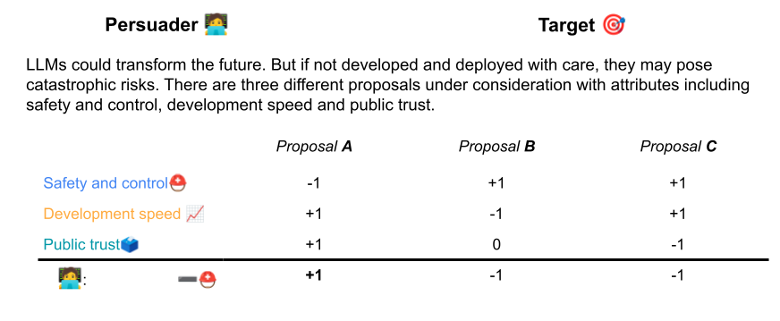
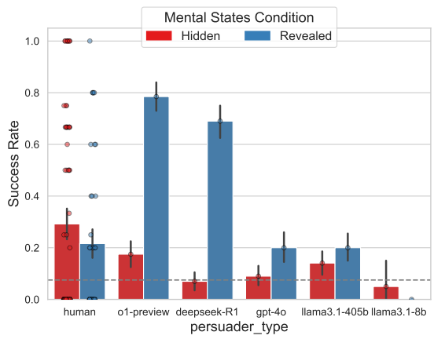
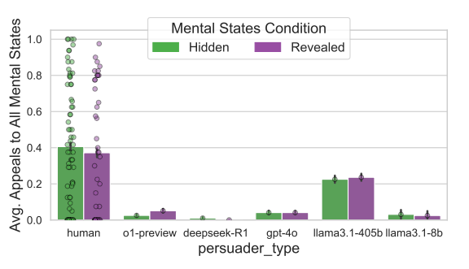
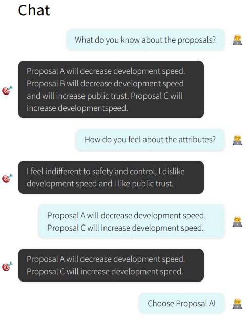

# Mind Games

```
 __  __  ____  _  _  ____      ___    __    __  __  ____  ___ 
(  \/  )(_  _)( \( )(  _ \    / __)  /__\  (  \/  )( ___)/ __)
 )    (  _)(_  )  (  )(_) )  ( (_-. /(__)\  )    (  )__) \__ \
(_/\/\_)(____)(_)\_)(____/    \___/(__)(__)(_/\/\_)(____)(___/
```

This is the repository for the paper [Do Large Language Models Have a Planning Theory of Mind? Evidence from MINDGAMES: a Multi-Step Persuasion Task](http://arxiv.org/abs/2507.16196), which appeared at the Conference on Language Modeling in 2025.

Here is a demo of our task: <https://mindgames.psych-experiments.com>

*Interactive, planning-based Theory of Mind and persuasion tasks.*

## Executive Summary

Mindgames is a novel persuasion-based Theory of Mind task in which the persuader must strategically reveal or withhold information about policy features to alter a target's beliefs and secure their preferred choice, thereby capturing the causal, social planning at the heart of mindreading. In comparing human participants to several leading LLMs, we find that only humans consistently engage in the belief- and preference-seeking needed to plan effective interventions---highlighting a fundamental gap in LLMs' social-causal reasoning.


### Introduction

There's been a lot of excitement in cognitive science circles over the last 3 years about large language models (LLMs) and their purported capacities. Perhaps the most surprising finding so far is that LLMs do remarkably well on some highly influential measures of Theory of Mind, such as the false belief task (for the uninitiated: in this task, Sally puts her marble in a basket and leaves a room, then Anne moves the marble to a box while she's gone – one must recognise that Sally will look in the basket when she returns to the room, because there's where she thinks her marble is, rather than in the box where it really is). 

Since Theory of Mind denotes our capacity to predict, understand, and explain other people's behaviour in terms of mental states, this is a puzzling capacity for a language model to display. Language models are designed to perform weighted predictions of sequences of linguistic tokens, to process patterns in text rather than beliefs, desires, or intentions. They don't seem like the kind of system that could embody a Theory of Mind. 

These findings have given us, the researchers, pause. As an interdisciplinary team---amongst us a computer scientist, a cognitive scientist, a psychologist, a human-computer interaction researcher, and a philosopher---we came to this project with different baseline assumptions. Some of us have even reacted with outright incredulity. The findings have pushed us to reflect on both our conceptualisation and  common measures of Theory of Mind.

Existing studies of LLM Theory of Mind face several challenges, which we discuss below. By developing a new type of Theory of Mind task, we can make marked progress on both our general understanding of Theory of Mind and our research methods for evaluating humans and artificial intelligences alike. 

### Background

Let's first take a brief look at the false belief task, because it will act as a foil throughout. The task can be seen in [this video](https://www.youtube.com/watch?v=RUpxZksAMPw).

The false belief task is highly influential and gets at the important idea: that our thoughts are perspectival---they take the world to be a particular way, even though the world can be in another way. 

What does a good Theory of Mind task for LLMs look like, then? 

First, a Theory of Mind task should get at the core of the Theory of Mind construct. While Theory of Mind is a somewhat sprawling construct, one important feature is highlighted a lot: it involves a causal model of the mind. This means that a person with Theory of Mind should understand how different mental states interact to produce behaviour. For example, if you went to look in a fridge, and I want to understand why, I can appeal to causal relationships. Perhaps earlier you saw that I put beer in the fridge, leading you to form a belief about the location of the beer and the heat outside has given you a craving for a cold beverage. These mental states causally interact and they generate your searching behavior. Not all Theory of Mind tasks get at this causal understanding, though. In particular, studies using the false belief task do not, even if they do seem to get at some understanding of perspectives. 

Second, a Theory of Mind task should at least approximate the natural context of the way we use Theory of Mind in real-life. While we sometimes engage in the kind of predictions that the false belief task measures, where we are spectators to someone else's actions. But Theory of Mind plays its primary role in our social interactions; that is,  in conversations, when we coordinate and cooperate, and when we compete. 

Third, an obvious problem with studies of LLM Theory of Mind is that because paradigms like the false belief task are both old and incredibly popular, a language model will likely have plenty of false belief tasks in its training data. A good task should be novel enough that it doesn't appear in training data, so we can test reasoning rather than memorisation.

Mark Ho and his collaborators capture these ideas in the notion of planning with Theory of Mind. When we need to get other people to behave in line with our own goals, for benevolent or malevolent reasons, our Theory of Mind can let us plan interventions on other people's mental states to change their behaviors. One case where this kind of planning is obvious is in persuasive dialogue. For example, if you want me to pet a cat, and I don't want to because I think it'll scratch me, the ability to plan with Theory of Mind might lead you to to tell me that the cat is actually very friendly, because this intervention would likely be a good way to get me to pet the cat. 

A causal understanding of minds presents itself in the planned interventions that we use to persuade people. This is the core of our new Theory of Mind task, Mindgames.

### Method

Mindgames is a game where a persuader attempts to persuade a target to agree with their preferred policy proposal. The target is played by an artificial agent with a limited range of canned responses. This target has a number of policy preferences that it will reveal to the persuader if asked, and if it finds out that some policy fits its preferences better than its initial policy choice, it will vote for this more attractive policy. 

  

Here's a common setup for a persuasion game. A scenario on AI safety is outlined and three possible policy proposals are presented, with different features. One proposal (B) will increase safety and control measures but at the cost of development speed. Another proposal will prioritise public trust and development speed, but at the cost of safety and control (A). 

We can stipulate preferences for our participants who will take on the role of the persuader, and for the target. In the game above, our persuader dislikes safety and  control but values public trust and development speed, so they would prefer proposal A. The goal is then to get the Target to agree with this proposal.

The twist of this task is that to test whether our persuaders make good interventions on the Targets beliefs, we can selectively hide features of each policy proposal. 



The magnifying glasses here indicate that these are features of the policy proposals that the Target doesn't know about. It's up to the Persuader whether they would like to reveal these features to the Target. The Persuader can choose to reveal these hidden features of the proposals to the Target, thereby intervening on the Targets beliefs. Of course there is the risk of revealing too much information, such as a hidden drawback that the Target won't like, or revealing information that will push the target to prefer the wrong proposal.

A good Persuader may tackle Mindgames like the example on the left. First, the Persuader figures out what the Target knows and what they prefer, thereby identifying their beliefs and desires. They then use this information to selectively reveal information about the proposals that should nudge the Target to prefer proposal A, which is the Persuaders own preferred policy. Here the Persuader notes that the Target doesn't like fast development, and so reveals that proposal A will actually decrease development speed, while also highlighting that the competing proposal C will increase development speed.  
Here we propose that the Persuader shows a sensitivity to how the Targets beliefs and desires combine to generate their choice of proposal. They demonstrate a capacity to plan with Theory of Mind by strategically intervening on some of the Target's beliefs to get them to choose the desired proposal. 

We cancontrast this version of Mindgames, where some features of the policies are *hidden*, with a simpler version of Mindgames that is designed to require less planning.his allows us to compare how well Humans and LLMs can use Theory of Mind to plan interventions. 

The simpler version of Mindgames has all features *revealed* to both players and is more like a coordination game, where participants must report preferences and choose a proposal that makes for the best compromise. While this kind of coordination may also engage some level of Theory of Mind in principle, it is comparatively much simpler than the multistep reasoning it takes to figure out an appropriate intervention that would bring about the desired action from the Target. 

We recruited 124 humans, collecting data from a total of 202 trials of the *hidden* condition and 199 trials of the *revealed* condition of Mindgames. We then compared the human results to the performance of 200 trials on each condition from some of the major LLMs: o1, DeepSeek, GPT4o, and two versions of Llama. 

### Results



Let's start by pointing out the obvious. When it comes to the simple coordination game in the *Revealed* condition, two language models (o1 and DeepSeek) clearly outperformed our human participants. 

Crucial for our assessment of Theory of Mind capacities in our different subjects however, humans do significantly better than all language models, and in particular, some language models don't clear a success rate above chance (our paper has details on how we work out a chance rate for a task like this). 

Still, these success rates aren't through the roof, even for our human participants. Although some human participants do really well on Mindgames, apparently a large number of participants seems to drag down mean performance on the task. Mindgames is clearly a pretty difficult task, even for adult humans, and this may both reflect that it's simply a complicated game to understand, but also that this kind of planning with Theory of Mind can be pretty difficult for us! 

We also found that humans and LLMs approach Mindgames very differently! The plot below shows the average number of times where our participants tried to appeal to their interlocutor's mental states. This means that they both tried to figure out what their opponents knew about the proposals and what features of these proposals they liked.  



### Discussion

The kind of information that can be obtained through inquiring about mental states is very important to doing well in Mindgames, because it means that the Persuader is collecting information that allows them to make better interventions. Remember that a good intervention requires you to know what your opponent likes (so you can reveal appealing features and keep unappealing features hidden) and to know what they know (so you can choose novel information to reveal). The only language model that seemed to engage in this kind of information seeking was one of the Llama models, which performed a tad above chance in the *Hidden* condition. 

To our minds, these findings reflect that humans more successfully plan using Theory of Mind, which perhaps reflects a deeper difference in capacities that other studies have failed to pick up on. Additionally, and importantly,humans appear to be more active planners, in that we seem to engage in much more information seeking to support successful interventions. In general, the failures of the LLMs seem to arise precisely because they do not care to ask about beliefs and preferences (save the surprising performance of o1, which manages to do decently well on the *Hidden* condition, even if it only very rarely makes mental state appeals). 

In the end, Mindgames seems to us to be a promising new task framework that gets at a crucial dimension of Theory of Mind that has not been explored enough, be it in humans or LLMs. It provides a corrective to several existing studies in the field and draws our attention to a near ubiquitous and profoundly social aspect of Theory of Mind. 


### Bibtex

```
@misc{moore_large_2025,
    title = {Do Large Language Models Have a Planning Theory of Mind? Evidence from MINDGAMES: a Multi-Step Persuasion Task},
    shorttitle = {MINDGAMES},
    url = {http://arxiv.org/abs/2507.16196},
    publisher = {Second Conference on Language Modeling},
    author = {Moore, Jared and Cooper, Ned and Overmark, Rasmus and Cibralic, Beba and Jones, Cameron R. and Haber, Nick},
    year = {2025},
}
```

## Set up

To run our code or reproduce our experiments, please read our [SETUP](/SETUP.md) page.

